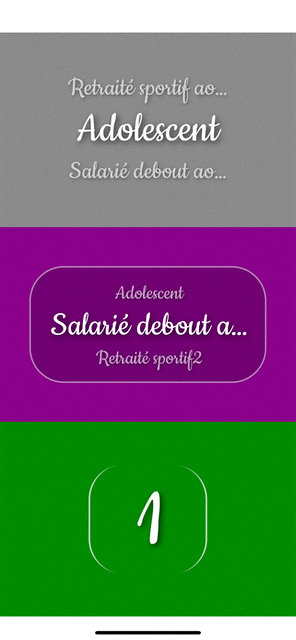

# react-native-carousel-picker
Carousel-picker is a component that allows you to display your data in a circular select/dropbox way.<br/>
It's a full typescript responsive component that uses reanimated 2.<br/>
The work is still in progress but you can use it and improve it if you want! PR are welcome.<br/>
<br/>
<a align="center" href="https://www.npmjs.com/package/@grean/react-native-carousel-picker">
  
</a>

## Demo
### Works on both iPhone and Android


## Installation
Using yarn:

```sh
yarn add @grean/react-native-carousel-picker
```

## Usage

```tsx
const currentItemIndex = 1
const [itemIndex, setItemIndex] = useState(currentItemIndex);
const items = [1, 2, 3, 4, 5]

const onChanged = (index: number) => {
  setItemIndex(index)
  console.log(`onChanged index ${index}`)
}

//removed code for brevety
  <View style={{
    flex: 1,
  }}>
    <Picker
      {...{
        items,
        index: itemIndex,
        onChanged,
        marginHorizontalPercentage: 0.05,
        spaceBetween: 1 / 1.75,
        textStyle: {
          paddingVertical: 10,
          textShadowColor: 'rgba(0, 0, 0, 0.75)',
          textShadowOffset: { width: 3, height: 3 },
          textShadowRadius: 10,
        },
      }}
    />
  </View>
```

## Component props
```tsx
interface ViewportProps<T> {
  allowFontScaling?: boolean //false: see RN Text prop
  containerStyle?: ViewStyle // all view style props
  discoverable?: boolean //true: allow horizontal swipe to discover hidden item's part
  display?: DisplayType //"TOP_BOTTOM": one of those "TOP_BOTTOM" | "CENTER_ONLY"
  fontSize?: number //200: fontsize value
  index?: number //current selected index
  items?: T[] //array of primitives of any types
  marginHorizontalPercentage?: number //0: pourcentage of width container, ie: 0.05
  marginVerticalPercentage?: number //0: pourcentage of height container, ie: 0.05
  onChanged?: (index: number) => void //Callback called when selected index changed
  opacityRangeOut?: number[] //Opacity interpolation threshold for items. Default value depends on display prop mode but you can still override them, ie: [0, 0.6, 1, 0.6, 0]
  scaleRangeOut?: number[] //Scale interpolation threshold for items. Default value depends on display prop mode but you can still override them, ie: [0, 0.6, 1, 0.6, 0]
  spaceBetween?: number //1 / 2.25: space between displayed items 
  textStyle?: TextStyle //all RN Text style props
}
```

## Testing
See Expo example app for testing with hot-reload, you can directly modify the code's component and see how your modifications looks like immediately.
```sh
git clone https://github.com/grean/react-native-carousel-picker.git
cd react-native-carousel-picker && yarn
cd example && yarn
yarn ios
```

## About
If you want to eat well and healthy, i recommand you to check out my mobile app [Dietethic.net](https://dietethic.net)<br/>

<a align="center" href="https://github.com/grean?tab=followers">
  
</a>
<br />
<a align="center" href="https://twitter.com/reanGuillaume">
  
</a>

## License 
MIT
